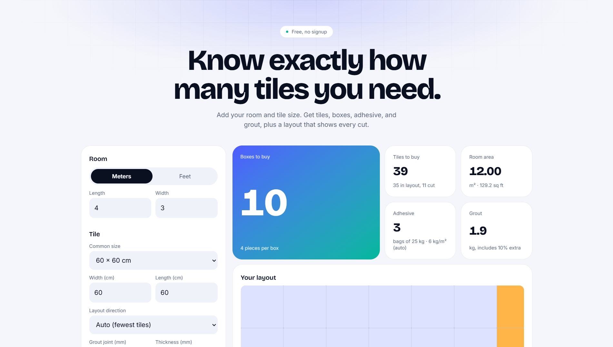

# Tile & Flooring Estimator

A free web app that tells you how many tiles, boxes, adhesive bags, and kilograms of grout you need for a room. Enter the room size and tile size, and it also draws the floor layout so you can see exactly which tiles need cutting.

**Live demo:** https://tile-estimator-ph.vercel.app



## Features

- Room size in meters or feet, with one-tap conversion
- Common tile sizes (30×30, 40×40, 60×60, 80×80, 30×60) or custom sizes
- Auto layout direction: compares both tile orientations and picks the one that needs fewer tiles
- Results for tiles, boxes, adhesive bags, grout (kg), and optional tile cost in pesos
- Adhesive coverage that adjusts to tile size, or a value you set yourself
- Visual floor layout with whole tiles and cut tiles in different colors
- Responsive layout that works on phones, with light and dark mode that follows the device

## Tech stack

- [Next.js](https://nextjs.org/) (App Router) and React
- TypeScript
- Tailwind CSS v4
- Deployed on [Vercel](https://vercel.com/)

## How the numbers work

The calculation lives in one plain file, [`lib/estimate.ts`](lib/estimate.ts), with no React in it.

- **Tiles:** columns and rows are `ceil((room + joint) / (tile + joint))`. Partial tiles at the edges count as one full tile. Waste (default 10%) is added on top, then rounded up.
- **Boxes:** tiles to buy divided by pieces per box, rounded up.
- **Adhesive:** room area × coverage (kg/m²) divided by bag size. When coverage is left blank, it uses a rule of thumb based on the longest tile side: 4 kg/m² up to 30 cm, 5 up to 45 cm, 6 up to 60 cm, and 7.5 above that.
- **Grout:** `area × (L + W) / (L × W) × tile thickness × joint width × 1.6`, plus 10% extra. Dimensions are in millimeters and 1.6 is a typical grout density.

These are estimates. Real coverage depends on the trowel notch, the floor, and the product, so check the product label or ask your supplier before ordering.

## Run it locally

```bash
git clone https://github.com/astralaster21/tile-estimator.git
cd tile-estimator
npm install
npm run dev
```

Then open http://localhost:3000.

## Project structure

```
app/             page, layout, and global styles (App Router)
components/      Field (input), Stat (animated result card), LayoutDrawing (SVG)
lib/estimate.ts  the calculation, no UI code
```

## Roadmap

- Multiple rooms with a combined total
- Print or save a quotation as PDF
- Filipino and English language toggle
